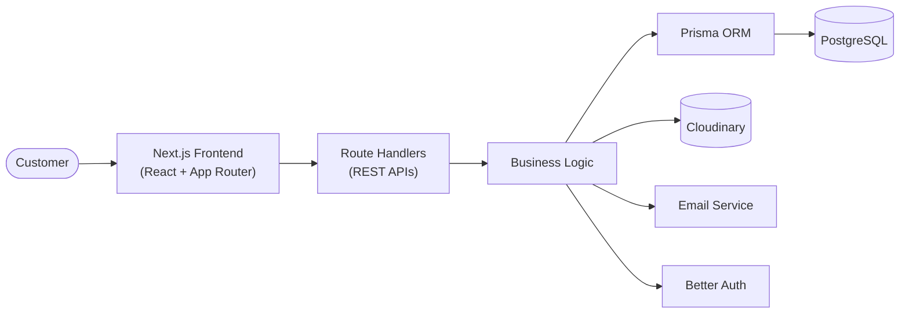
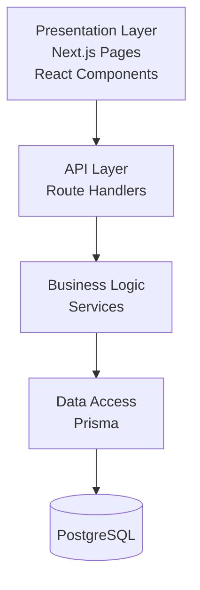
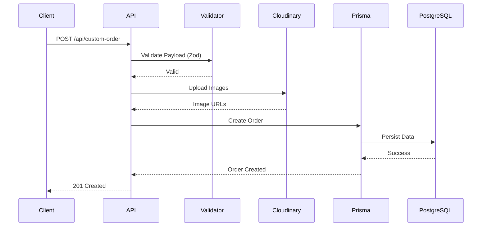
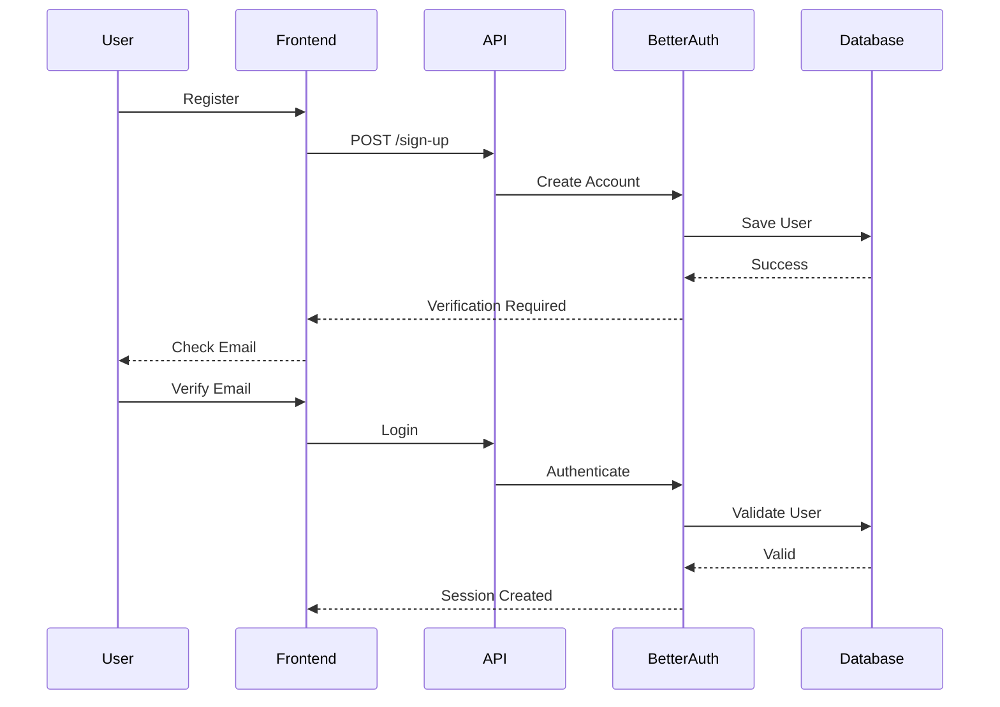
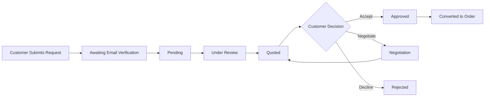

# 🛋️ Homify

> **A Modern Full-Stack Commerce Platform for Furniture Businesses**

<p align="center">
    
</p>

Homify is a modern full-stack web application that helps furniture businesses showcase products, manage customer enquiries, and streamline custom furniture requests through a fast, intuitive digital experience.

**Status:** 🚧 Actively Under Development

## Overview

Homify is a full-stack commerce platform built to modernize how furniture businesses engage with customers online. It combines a responsive storefront with backend services that support authentication, product management, custom furniture requests, image uploads, and business workflows.

The project originated as a software engineering capstone but has since evolved into a long-term engineering project focused on exploring modern full-stack development, backend architecture, and cloud-native application design.

Rather than treating the backend as an afterthought, Homify is being developed as a complete software system where user experience, business logic, and infrastructure evolve together.

## Why Homify?

Furniture businesses often rely on walk-in customers, phone calls, and messaging platforms to showcase products, discuss custom furniture requirements, and process orders. While these methods are familiar, they frequently lead to fragmented communication, manual processes, and limited visibility into customer requests.

Homify addresses these challenges by providing a centralized platform where customers can discover products, submit custom furniture requests, and interact with the business through a structured digital experience.

By combining a modern frontend with a robust backend, the platform aims to simplify business operations while improving the overall customer experience.

## Project Goals

Homify is guided by four primary objectives:

### Deliver an Exceptional Customer Experience

Build an intuitive platform that enables customers to browse products, request custom furniture, and communicate seamlessly with the business.

### Build a Modern Full-Stack Architecture

Implement a scalable backend using RESTful APIs, relational databases, authentication, and server-side validation while maintaining a clean and maintainable codebase.

### Digitize Furniture Businesses

Provide businesses with tools for managing products, customer enquiries, and custom furniture workflows from a single platform.

### Continuously Evolve

Use Homify as a long-term engineering project to explore modern backend development, cloud architecture, DevOps practices, and scalable software design.

## Current Functionality

Homify is currently focused on delivering the core functionality required by a modern furniture commerce platform. Development is being carried out iteratively, with each feature designed to integrate into a scalable long-term architecture rather than existing in isolation.

### Customer Experience

- Browse a curated furniture catalogue
- View detailed product information
- Submit custom furniture requests
- Upload reference images
- Create and manage user accounts
- Secure authentication and session management
- Responsive user experience across desktop and mobile devices

### Backend Services

- RESTful API endpoints built with Next.js Route Handlers
- Authentication and authorization using Better Auth
- PostgreSQL database with Prisma ORM
- Request validation using Zod
- Image storage and management through Cloudinary
- Email verification for customer workflows

### Currently in Development

- Shopping cart
- Checkout workflow
- Order management
- Admin dashboard
- Product management
- MPesa payment integration

  ## Architecture Overview

Homify follows a modular monolithic architecture built with the Next.js App Router.

Rather than separating the frontend and backend into independent services, both layers are developed within a single codebase while maintaining clear separation of responsibilities. User interfaces, RESTful APIs, business logic, authentication, and data persistence work together as independent modules, simplifying development while remaining scalable.

This architecture provides several advantages:

- Shared TypeScript types across the frontend and backend
- Simplified deployment and project structure
- Clear separation between presentation, business logic, and persistence
- Faster development without sacrificing maintainability

As the platform evolves, the architecture is designed to support future expansion into independently deployable services where appropriate.


## Technology Stack

| Layer | Technology | Purpose |
|---------|------------|---------|
| Frontend | Next.js 16, React 19 | User interface and application framework |
| Backend | Next.js Route Handlers | RESTful API development |
| Database | PostgreSQL | Persistent relational data storage |
| ORM | Prisma | Database access and schema management |
| Authentication | Better Auth | Authentication and session management |
| Validation | Zod | Request validation and type safety |
| State Management | Redux Toolkit | Client-side state management |
| Server State | TanStack Query | API data fetching and caching |
| Styling | Tailwind CSS | Responsive user interface styling |
| Image Storage | Cloudinary | Customer image uploads |
| Email | Nodemailer | Transactional email delivery |
| Language | TypeScript | End-to-end type safety |

## Architecture Overview

Homify follows a modular monolithic architecture built with the Next.js App Router.

Rather than separating the frontend and backend into independent services, both layers are developed within a single codebase while maintaining clear separation of responsibilities. User interfaces, RESTful APIs, business logic, authentication, and data persistence work together as independent modules, simplifying development while remaining scalable.

This architecture provides several advantages:

- Shared TypeScript types across the frontend and backend
- Simplified deployment and project structure
- Clear separation between presentation, business logic, and persistence
- Faster development without sacrificing maintainability

As the platform evolves, the architecture is designed to support future expansion into independently deployable services where appropriate.

## 🏗️ System Architecture




## 🏗️ Layered Architecture



## 🗄️ Database Design

Homify uses PostgreSQL as its primary relational database, with Prisma serving as the Object-Relational Mapper (ORM).

The current data model is centered around authentication, customer management, and custom furniture requests. As development continues, the schema will evolve to support additional capabilities such as product management, shopping carts, order processing, inventory management, and multi-vendor functionality.

Current core entities include:

- Users
- Accounts
- Sessions
- Verification Tokens
- Custom Orders
- Custom Order Images

Relationships are modeled using foreign keys to maintain referential integrity and ensure data consistency across the application. The database schema is developed iteratively alongside application features, allowing it to evolve naturally as new business requirements emerge.

> **Database ER Diagram**
>
> *The diagram below is generated directly from the Prisma schema to ensure the documentation remains synchronized with the current implementation.*


## 🌐 REST API

Homify exposes RESTful API endpoints that power both customer-facing features and backend business workflows.

The APIs are organized by domain, making the application easier to maintain and extend as new functionality is introduced.

| Method | Endpoint | Description |
|---------|----------|-------------|
| GET | `/api/products` | Retrieve product catalogue |
| POST | `/api/products` | Create products (Admin) |
| POST | `/api/custom-order` | Submit custom furniture requests |
| POST | `/api/upload` | Upload customer reference images to Cloudinary |
| POST | `/api/save-images` | Persist uploaded image metadata |
| POST | `/api/check-email` | Verify customer email |
| GET | `/api/auth/*` | Authentication endpoints (Better Auth) |



## Authentication

Authentication is implemented using Better Auth with PostgreSQL-backed session storage.

The current implementation supports secure user registration, login, email verification, session management, and role-based authorization.

Authentication is designed to protect customer information while providing a seamless user experience across the application.

By relying on server-side session management and secure authentication workflows, Homify avoids exposing sensitive application state to the client.




## 🔄 Custom Order Workflow

One of Homify's core features is enabling customers to request custom-built furniture using reference images and project specifications.

Unlike standard e-commerce purchases, custom furniture orders require a review and quotation process before becoming confirmed orders. Homify models this workflow as a series of clearly defined states, allowing both customers and administrators to track the progress of each request.

The workflow below illustrates how a customer request moves through the system from submission to approval.





## Installation

### Prerequisites

Before running Homify locally, ensure the following tools are installed:

- Node.js 20+
- npm
- PostgreSQL
- Git

### Clone the Repository

```bash
git clone https://github.com/jeremiahongwenyi/homify.git

cd homify
```

### Install Dependencies

```bash
npm install
```

### Configure Environment Variables

Create a `.env` file in the project root and configure the required environment variables.

```bash
cp .env.example .env
```

### Generate Prisma Client

```bash
npx prisma generate
```

### Apply Database Migrations

```bash
npx prisma migrate dev
```

### Start the Development Server

```bash
npm run dev
```

The application will be available at:

```
http://localhost:3000
```

## Environment Variables

Homify integrates with several external services for authentication, database access, image storage, and email delivery.

The following environment variables are required:

| Variable | Purpose |
|------------|--------------------------------|
| DATABASE_URL | PostgreSQL database connection |
| BETTER_AUTH_SECRET | Authentication secret |
| BETTER_AUTH_URL | Application URL |
| CLOUDINARY_CLOUD_NAME | Cloudinary account |
| CLOUDINARY_API_KEY | Cloudinary API Key |
| CLOUDINARY_API_SECRET | Cloudinary API Secret |
| SMTP_HOST | SMTP Server |
| SMTP_PORT | SMTP Port |
| SMTP_USER | Email username |
| SMTP_PASSWORD | Email password |
| NEXT_PUBLIC_APP_URL | Frontend application URL |

Sensitive credentials should never be committed to version control.
## 🏗️ Codebase Architecture

The project follows a feature-oriented architecture that separates presentation, business logic, API routes, data access, and shared utilities. This structure promotes maintainability, scalability, and a clear separation of concerns as the application continues to evolve.

```text
homify/
│
├── src/
│   ├── app/
│   │   ├── api/               # Next.js Route Handlers (REST APIs)
│   │   └── globals.css
│   │
│   ├── components/            # Shared UI components
│   │
│   ├── features/              # Feature-based modules
│   │
│   ├── hooks/                 # Custom React hooks
│   │
│   ├── lib/                   # Utilities, configuration & shared services
│   │
│   ├── providers/             # Redux, React Query & application providers
│   │
│   ├── schemas/               # Zod validation schemas
│   │
│   ├── services/              # Business services & interfaces
│   │
│   └── types/                 # Shared TypeScript types
│
├── prisma/                    # Prisma schema & database migrations
│
├── generated/                 # Auto-generated Prisma client
│
├── public/                    # Static assets
│
└── docs/                      # Project documentation
```

### Directory Overview

| Directory | Responsibility |
|------------|----------------|
| `src/` | Root source directory containing the application code |
| `src/app/` | Next.js App Router pages, layouts, and Route Handlers (REST APIs) |
| `src/components/` | Reusable UI components shared across the application |
| `src/features/` | Feature-oriented modules containing business logic and UI |
| `src/hooks/` | Custom React hooks |
| `src/lib/` | Shared utilities, helpers, configuration, and common services |
| `src/providers/` | Application providers including Redux, React Query, Theme, and Authentication |
| `src/schemas/` | Zod schemas for request validation and type-safe API contracts |
| `src/services/` | Business services, interfaces, and application logic |
| `src/types/` | Shared TypeScript types and interfaces |
| `prisma/` | Prisma schema and database migrations |
| `generated/` | Auto-generated Prisma Client |
| `public/` | Static assets (images, icons, fonts, etc.) |
| `docs/` | Architecture diagrams and technical documentation |

## Architectural Decisions

Every major technology in Homify was selected to solve a specific engineering problem. Rather than adopting tools based solely on popularity, each decision was made by considering the project's current requirements, long-term vision, maintainability, and developer experience.

### Why Next.js App Router?

Homify is built using the Next.js App Router to unify the frontend, backend, and routing within a modern React architecture.

**Why this approach?**

- Supports React Server Components and server rendering
- Simplifies project organization through file-based routing
- Enables colocating pages, layouts, and API routes
- Provides an excellent TypeScript developer experience

**Trade-off:** The App Router has a steeper learning curve than the traditional Pages Router, but its long-term architectural benefits outweigh the additional complexity.

---

### Why Route Handlers Instead of a Separate Backend?

Rather than introducing a standalone backend framework such as Express, Homify uses Next.js Route Handlers to expose its REST APIs.

**Why this approach?**

- Keeps the frontend and backend within a single codebase
- Enables shared TypeScript types across the application
- Simplifies deployment and project maintenance
- Maintains a clear separation between UI and business logic

**Trade-off:** A dedicated backend may offer greater flexibility for independently scalable services, but Route Handlers provide all the backend capabilities Homify currently requires while keeping the architecture simple.

---

### Why PostgreSQL & Prisma?

Homify uses PostgreSQL with Prisma ORM to provide a reliable, scalable, and type-safe data layer.

**Why this approach?**

- PostgreSQL provides strong relational modelling and ACID-compliant transactions
- Prisma offers type-safe database access and automatic TypeScript generation
- Built-in migrations simplify schema evolution
- Improves maintainability and developer productivity

**Trade-off:** ORMs abstract much of SQL, which can reduce flexibility for highly specialized queries. For Homify, the productivity and type safety significantly outweigh this limitation.

---

### Why Better Auth?

Authentication is implemented using Better Auth with PostgreSQL-backed session storage.

**Why this approach?**

- Secure authentication and session management
- Minimal configuration with excellent TypeScript support
- Database-backed sessions improve security and reliability
- Allows development to focus on business functionality instead of authentication infrastructure

**Trade-off:** Better Auth has a smaller ecosystem than more established authentication solutions, but its simplicity, type safety, and developer experience make it an excellent fit for Homify.

---

### Why Zod?

Every incoming API request is validated using Zod before business logic is executed.

**Why this approach?**

- Prevents invalid or malformed requests
- Produces consistent API error responses
- Improves application reliability
- Keeps API contracts explicit and type-safe

**Trade-off:** Schema validation introduces a small processing overhead, but the improvements in reliability and maintainability make it a worthwhile investment.

---

### Why Cloudinary?

Customer-uploaded images are managed through Cloudinary rather than storing files directly within the application.

**Why this approach?**

- Secure cloud-based file storage
- Automatic image optimization
- Global CDN delivery for faster loading
- Simplifies media management and scalability

**Trade-off:** Introducing a third-party service creates an external dependency, but the performance, reliability, and operational simplicity far outweigh managing media infrastructure internally. 
## Roadmap

Homify is under active development, with new functionality being introduced incrementally.

### Short-Term Goals

- Complete shopping cart
- Complete checkout workflow
- Product management
- Admin dashboard
- Order management
- Customer order tracking

### Mid-Term Goals

- MPesa payment integration
- Email notifications
- Inventory management
- Sales analytics
- Role-based administration

### Long-Term Vision

The long-term vision is to evolve Homify into a production-ready commerce platform capable of supporting multiple furniture businesses through a shared marketplace architecture.

Future iterations will explore:

- Multi-vendor support
- Cloud deployment on AWS
- Containerized deployments with Docker
- Background job processing
- Search and recommendation services
- CI/CD automation

## Lessons Learned

Building Homify has been as much about engineering growth as it has been about delivering software.

Throughout the project, I have strengthened my understanding of:

- Designing RESTful APIs
- Relational database modelling with PostgreSQL
- Authentication and session management
- Server-side validation
- File upload workflows
- Backend architecture using Next.js Route Handlers
- ORM-based database access with Prisma
- Building maintainable full-stack applications

Perhaps the biggest lesson has been recognizing that good software architecture is not about adding complexity—it's about making thoughtful decisions that allow systems to evolve over time.

## Contributing

Homify is currently a personal project and is under active development.

Feedback, ideas, and constructive discussions are always welcome.

If you'd like to contribute, feel free to fork the repository, open an issue, or submit a pull request.

## Author

**Jeremiah Ongwenyi**

Software Engineer

- https://www.linkedin.com/in/jeremiah-ongwenyi
- https://jeremiahongwenyi.vercel.app/
- jerrmiahongwenyi@gmail.com


